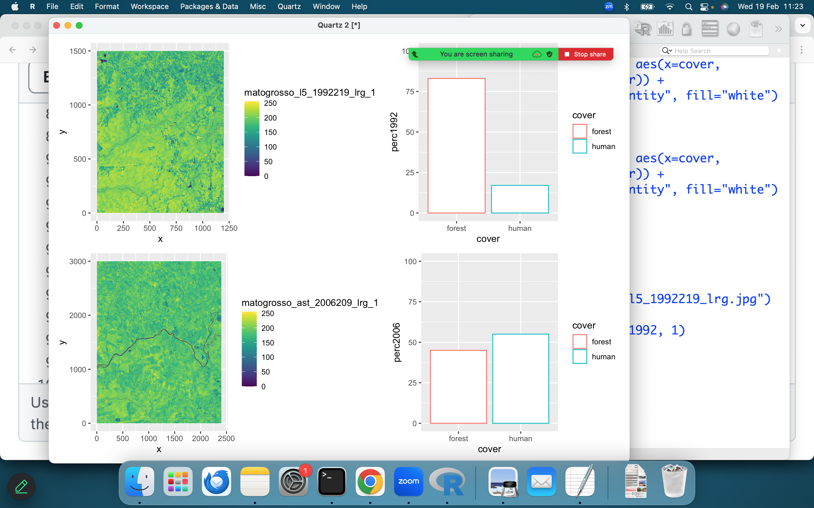

# Using ggplot2 to show satellite images (and graphs) and their change space and time

## Single layers
Once a dataframe has been built with thwe following code:

``` {r echo=FALSE}
library(terra)
library(imageRy)
library(ggplot2)
library(patchwork)

# build the table
# columns:
cover <- c("forest","human")
perc1992 <- c(83,17)
perc2006 <- c(45,55)
finalt <- data.frame(cover, perc1992, perc2006)
```

We can build graphs with ggplot2 using both histograms and images:

``` r
p1 <- ggplot(finalt, aes(x=cover, y=perc1992, color=cover)) +
  geom_bar(stat="identity", fill="white") +
  ylim(c(0,100))

p2 <- ggplot(finalt, aes(x=cover, y=perc2006, color=cover)) +
  geom_bar(stat="identity", fill="white") +
  ylim(c(0,100))

p1 + p2

p1 / p2

(p1 | p2 | p1) /
      p2

# ggplot2
im.list()

mato <- im.import("matogrosso_ast_2006209_lrg.jpg")
mato1992 <- im.import("matogrosso_l5_1992219_lrg.jpg")

p3 <- im.ggplot(mato, 1)
p4 <- im.ggplot(mato1992, 1)

(p1 | p2 | p1) /
      p3

(p4 | p1) /
(p3 | p2)
```

> Notice that the satellite images can be plotted with the imageRy package thanks to the im.ggplot() function.

The resulting output will be something like:



## RGB spaces

gRGB() will plot RGB layers instead of single bands

``` r
p1 <- ggRGB(mato1992, r=1, g=2, b=3, stretch="lin")
p2 <- ggRGB(mato2006, r=1, g=2, b=3, stretch="lin")
p3 <- ggRGB(mato1992, r=2, g=1, b=3, stretch="lin")
p4 <- ggRGB(mato2006, r=2, g=1, b=3, stretch="lin")
p5 <- ggRGB(mato1992, r=2, g=3, b=1, stretch="lin")
p6 <- ggRGB(mato2006, r=2, g=3, b=1, stretch="lin")
```

The patchwork package will then join all the graphs:
``` r
p1 + p2 + p3 + p4 + p5 + p6
```


> Note: The argument stretch is used to stretch images. The lin stretch is the same of that of im.ploRGB from imageRy


