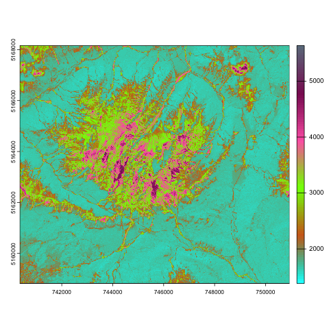

# PR_stats_live
This is a repo storing the code for the PR Stats course on basic remote sensing


## Languages used during the course 📖
The following languages will be used:
+ Markdown
+ R
+ LaTeX

## Packages used
+ ggplot2
  + graphical editing
  + new graphs
+ terra
  + remote sensing data analysis
  + matrix data management
+ imageRy
  + remote sensing teaching
  + data visualization
+ tidyverse
  + dataframe management
  + matrix data implementation


> The course will e available online and on demand

> The course will be available for one month

## Example of code
With the following code, we can attain the following image:

``` r
png("nameoftheimage.png")
plot(b2)
dev.off()
```




